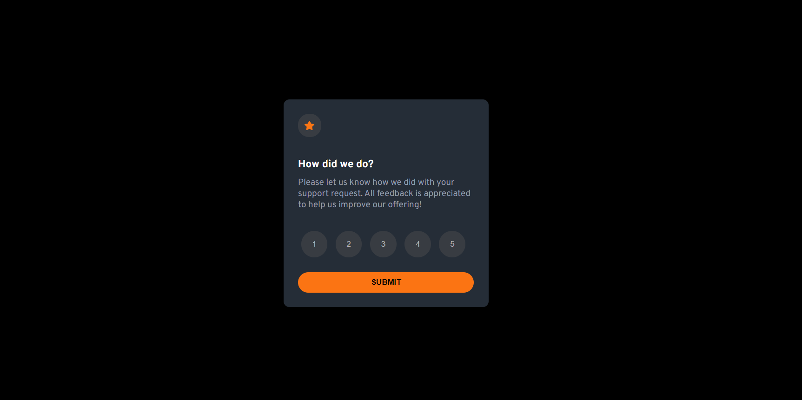
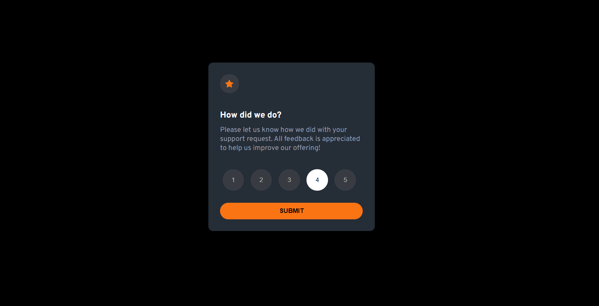
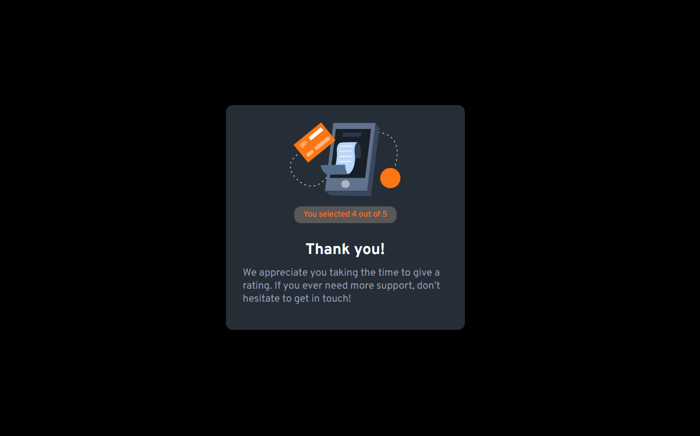

# Frontend Mentor - Interactive rating component solution

This is a solution to the [Interactive rating component challenge on Frontend Mentor](https://www.frontendmentor.io/challenges/interactive-rating-component-koxpeBUmI).
## Table of contents

- [Overview](#overview)
  - [The challenge](#the-challenge)
  - [Screenshot](#screenshot)
  - [Links](#links)
- [My process](#my-process)
  - [Built with](#built-with)
  - [What I learned](#what-i-learned)
- [Author](#author)
- [Acknowledgments](#acknowledgments)

## Overview

### The challenge

Users should be able to:

- View the optimal layout for the app depending on their device's screen size
- See hover states for all interactive elements on the page
- Select and submit a number rating
- See the "Thank you" card state after submitting a rating

### Screenshot

### Links

- Solution URL: https://www.frontendmentor.io/solutions/responsive-interactive-rating-page-xUI6tNRKS6
- Live Site URL: 

## My process

### Built with

- Semantic HTML5 markup
- CSS custom properties
- Flexbox
- CSS Grid
- Mobile-first workflow

### What I learned

I have learnt how to hide and display elements using javascript. When the user clicks on the submit button, Thankyou box is displayed and the current page is hidden. I loved doing it.

## Author

- Frontend Mentor - [@VismayaSKumar](https://www.frontendmentor.io/profile/VismayaSKumar)
- GitHub - [@VismayaSKumar](https://github.com/VismayaSKumar)

## Acknowledgments

This project was inspired by the Frontend Mentor community. Special thanks to all the mentors and fellow developers who provided feedback and support.

